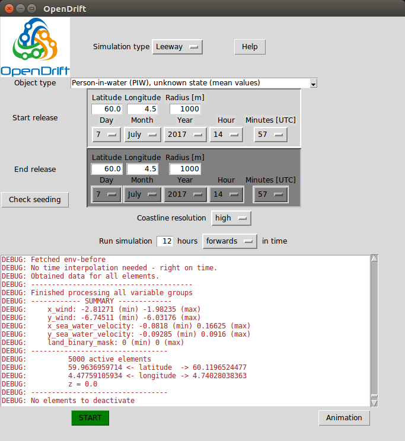

Graphical User Interface
========================

OpenDrift comes with a basic Graphical User Interface, which can be started with the command:

.. code::

   $ opendrift_gui.py

When OpenDrift has been installed or the `scripts-folder <https://github.com/OpenDrift/opendrift/tree/master/opendrift/scripts>`_ is
added to your PATH-variable. Otherwise, the command `$ python opendrift_gui.py`
can be run from within the scripts-folder. On Windows, the `opendrift_gui.py`
script may be launched by a double-click.

Choosing a model and parameters
-----------------------------------
The :mod:`Leeway model (Search and Rescue) <opendrift.models.leeway>`, :mod:`OpenOil (oil drift) <opendrift.models.openoil>`, :mod:`ShipDrift model <opendrift.models.ShipDrift>` and :mod:`OpenBergOld model <opendrift.models.openberg_old>` are available in the GUI.

The first step is to select the model of interest from the upper menu.
If Leeway or OpenOil are chosen, the second dropdown-menu will allow you to select either

  * an oil type (from `NOAA OilLibrary <https://github.com/NOAA-ORR-ERD/OilLibrary>`_), or
  * a `Leeway object category <https://www.dropbox.com/s/d5jhwo6y5zldxgh/Drivbanehjelp.pdf?raw=1>`_.

If the ShipDrift model is selected, the dimensions of the ship can be selected (beam, length, draft and height).

The ice berg drift simulation has parameters `wind_drift_factor`, `water_line_length` and `keel_depth`. The `wind_drift_factor` is unlikely that you need to change, while the other parameters describe the geometry of the ice berg. These are described in more detail in the :mod:`OpenBergOld reference <opendrift.models.openberg_old>` at :ref:`openberg_parameters`.

The following steps are the same for all models:

Seeding of particles
--------------------
* Choose a starting point for the seeding (initialisation) of particles. Latitude and longitude must be given in decimal degrees, and negative longitudes correspond to west of Greenwich.
* The radius is an uncertainty radius (standard deviation, given in meters) around the given location within which all the (5000) elements will be seeded.
* Optional:

  * the end time can be changed if a continuous release of particles over a time span is desired, simulating e.g. a leaking well,
  * the end position can be changed if particles shall be released between the start and end positions, simulating e.g. a ship track.
  * or a combination of both.

* Note that whenever the start position or time is updated, the end position/time will be copied/overwritten.
* By clicking ``Check seeding`` it is possible to see a plot of the seeding positions before the simulation is started. Note that it it can take up to about 30 seconds before the plot is shown.

Simulation time
---------------
* Simulations may by run forwards or backwards (backtracking, to check from where the object or oil has drifted)
* The simulation duration is given in hours. Note that simulations longer than 100 hours may take significant time (> 10 minutes), especially for oil drift.

Forcing data
------------
The sources used for current, wind and waves are given in `this list <https://github.com/OpenDrift/opendrift/blob/master/opendrift/scripts/data_sources.txt>`_, in prioritized order.
The forcing data are obtained/downloaded from remote servers (Thredds, OPeNDAP) during the simulation, and has global coverage, but high resolution for the North Atlantic only.

Whenever wave data is not available, OpenDrift will calculate wave parameters from wind.

Simulation and analysis
-------------------------
* The simulation is started by clicking ``START``

* The simulation will take from less than a minute for a short (12 hours) Leeway simulation and up to 10 minutes or more for a long (100 hours) oil drift simulation. Oil drift simulations takes more time due to heavy vertical turbulence calculations.

  * It is not possible to stop an ongoing simulation, except for using a task manager (or `kill` command in Linux). The user interface is unresponsive during the simulation.

* After the simulation, the result may be analysed with buttons appearing at the bottom:

  * ``Animation``: an animation of the simulation is shown or saved to file.
  * ``Oil budget`` (oil drift only): the time-history of the :mod:`oil budget <opendrift.models.openoil>` is shown or saved to file.
  * MET Norway only: a button ``Show in Diana`` will launch the Diana analysis tool.

    * Note that this is local Diana, not VGL-version.
    * The present and previous simulations may be viewed by opening ``Felter -> Drivbane_OpenDrift`` and then selecting ``Leeway``, ``Oljedrift`` or ``ShipDrift``. Note that the simulations will be sorted by the starting-time of the simulations, not the time at which the simulation was performed. Thus if you performed a simulation starting back in time, it might not be the last item in the list (`Referansetid`). Click on all the items in felter (submerged, stranded, surface), and then `Utfør`. For oil drift simulations, submerged particles are blue, surface oil is grey or black.

